# Тестування працездатності системи

## Запуск сервера
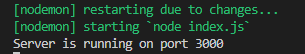

## Тестування для користувачів

### POST /user

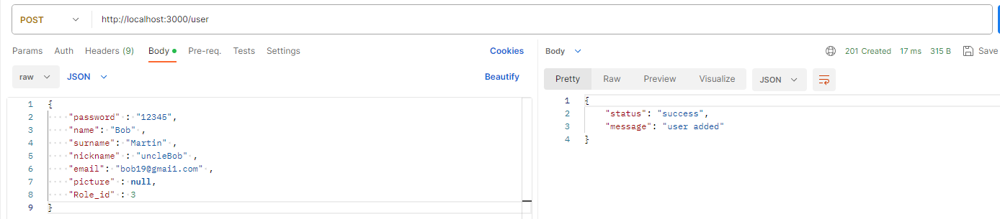

### GET /user

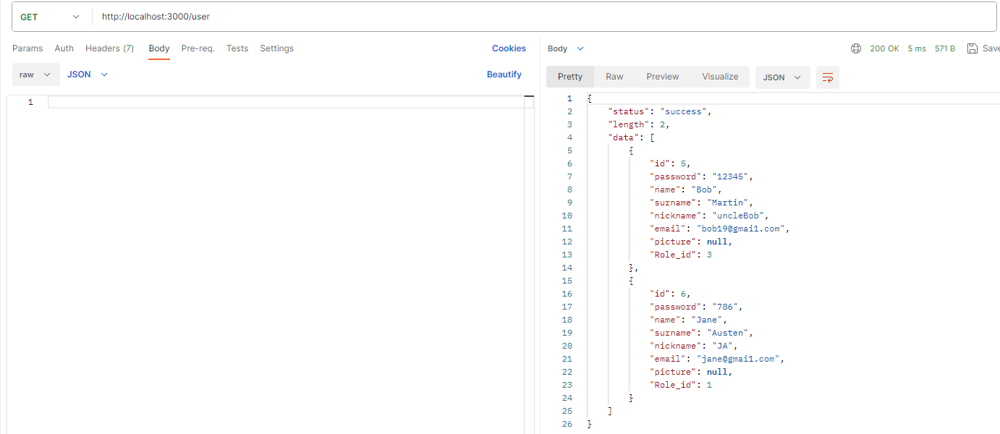

### PUT /user/:id

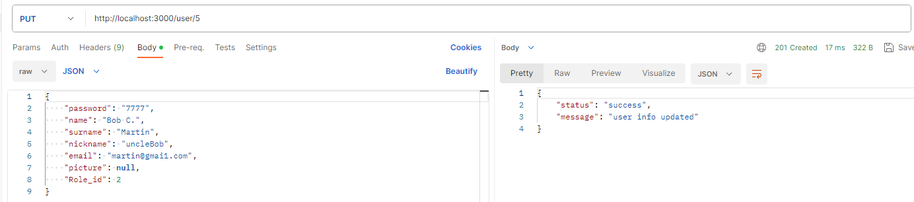

### GET /user/:id

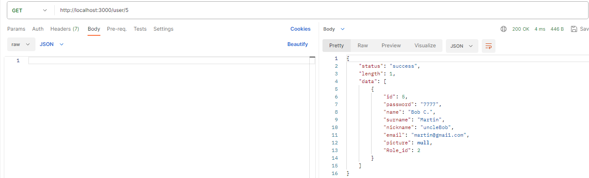

### DELETE /user/:id

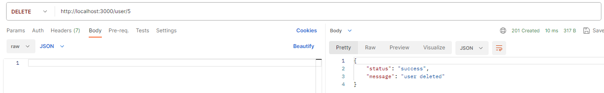
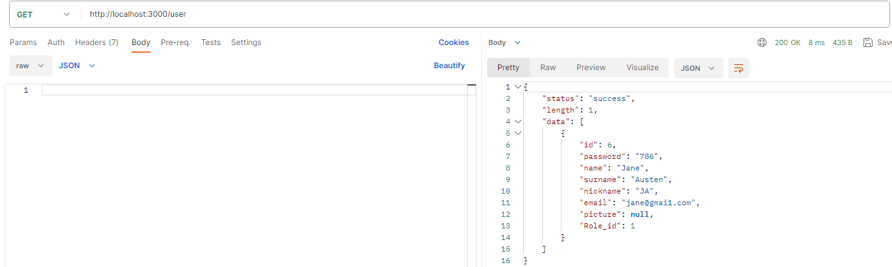

## Тестування для опитувань

### POST /quiz

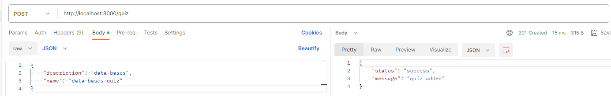

### GET /quiz

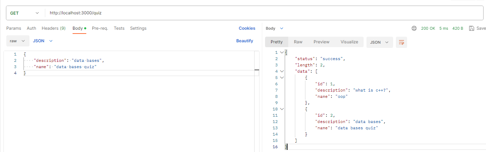

### PUT /quiz/:id

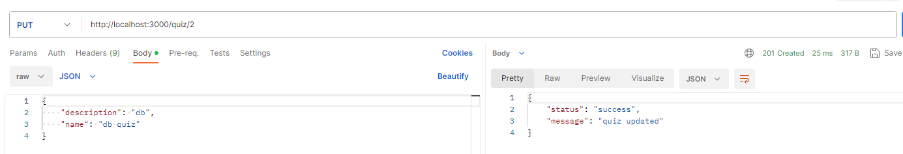

### GET /quiz/:id

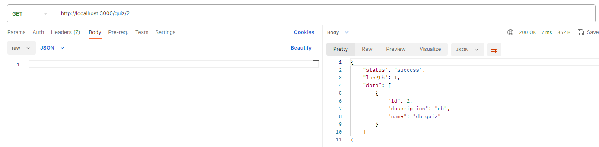

### DELETE /quiz/:id

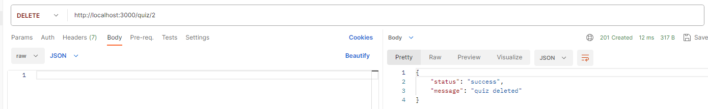
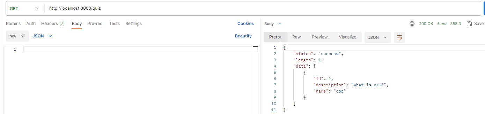

## Тестування для питань

### POST /question

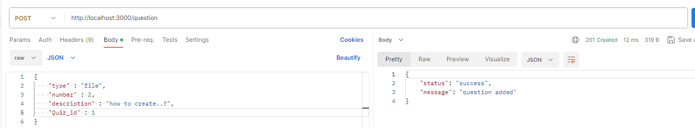

### GET  /question

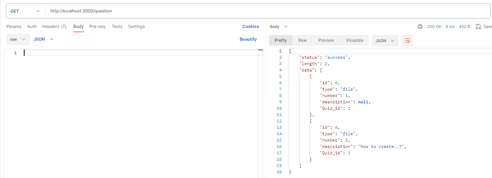

### PUT  /question/:id

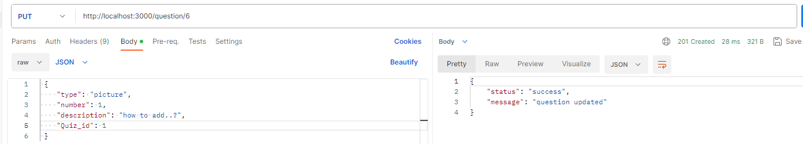

### GET  /question/:id

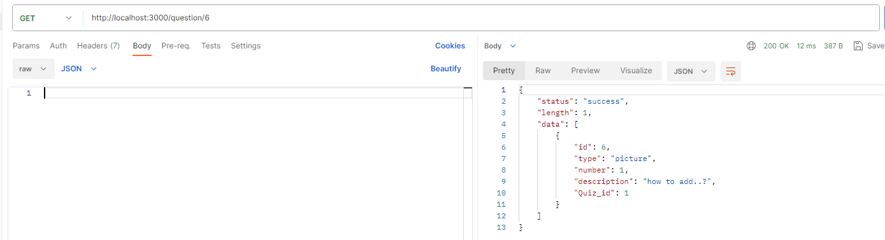

### DELETE  /question/:id

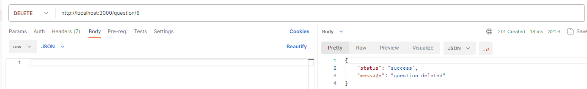
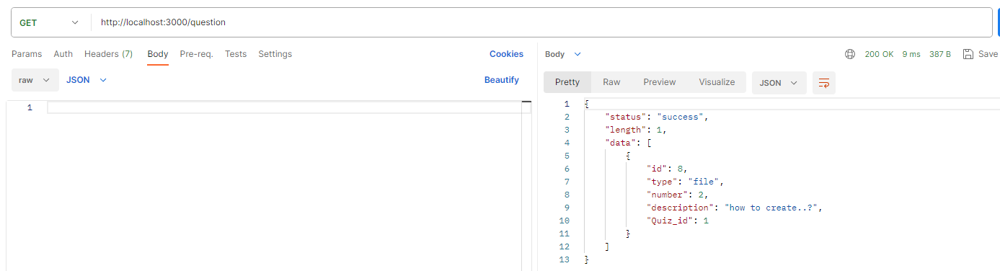

